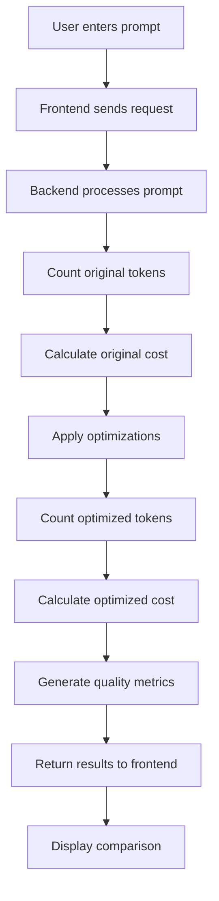

# Prompt Optimization Middleware - Project Summary

This document summarizes all the changes and improvements made to the Prompt Optimization Middleware project.

## Project Overview

The Prompt Optimization Middleware is a web-based application designed to optimize prompts for Large Language Models (LLMs) by reducing token usage while preserving semantic quality. The system enables cost-efficient LLM interactions through intelligent prompt compression and provides detailed cost-benefit analysis.

### Core Features

- Prompt optimization using multiple strategies
- Token counting and cost estimation for supported models
- Quality evaluation via BLEU, ROUGE, and semantic similarity metrics
- Web-based dashboard for visual comparison of original vs. optimized prompts

## Implemented Changes

### 1. Simplified User Interface

#### Prompt Optimization Page
- Simplified to only require prompt input and optimization button
- Default model set

#### About Page
- Added "How to Use" section with clear instructions
- Maintained only active optimization strategies:
  1. Structural Pruning
  2. Summarization
  3. Formatting Normalization

#### Home Page
- Simplified feature grid to three core cards:
  1. Token Reduction
  2. Cost Savings
  3. Quality Metrics

### 2. Enhanced UI/UX Design

#### Header Improvements
- Updated gradient background using project primary colors
- Improved text styling with better gradient effects and text shadow
- Enhanced navigation links with glass-morphism effect and borders
- Added active state styling for current page indication
- Better responsive design for mobile devices
- Subtle backdrop filter effects for depth
- Improved spacing and typography

#### Prompt Comparison Display
- Changed from side-by-side to stacked layout
- Increased text area size for better visibility
- Added better styling with borders and improved typography
- Used monospace font for better readability

#### Text Alignment Fixes
- Fixed alignment issues in the About page's "How to Use" section
- Resolved conflicting text-align properties between parent and child elements
- Added responsive adjustments for better mobile display

### 3. Technical Improvements

#### Cost Estimation
- Increased decimal places in cost display (from 4 to 6)
- Provides more accurate cost comparisons, especially for small differences

#### API Documentation
- Updated README.md to reflect current implementation
- Accurately documented active optimization strategies

#### Code Structure
- Maintained clean separation between frontend and backend
- Preserved modular design with dedicated folders
- Ensured consistency with existing architecture

## Technology Stack

### Frontend
- React with Vite
- React Router for navigation
- CSS for styling

### Backend
- Node.js with Express
- Tiktoken for token counting
- RESTful API architecture

## System Workflow

The prompt optimization system follows these steps:

1. **User Input**: User enters a prompt in the text area on the Optimization page
2. **Request Processing**: Frontend sends the prompt to the backend via REST API
3. **Token Counting**: Backend counts tokens in the original prompt using Tiktoken
4. **Cost Calculation**: System calculates the cost of the original prompt based on the model
5. **Optimization**: Backend applies optimization strategies:
   - Formatting Normalization (removes extra whitespace)
   - Structural Pruning (removes redundant phrases)
   - Summarization (compresses long prompts)
6. **Optimized Token Counting**: System counts tokens in the optimized prompt
7. **Optimized Cost Calculation**: System calculates the cost of the optimized prompt
8. **Metrics Generation**: System generates quality metrics (BLEU, ROUGE, Semantic Similarity)
9. **Response**: Backend returns all data to the frontend
10. **Display**: Frontend displays comparison of original vs optimized prompts with metrics



## Metrics Explanation

### BLEU (Bilingual Evaluation Understudy)
- **How it works**: Measures the similarity between the original and optimized prompts by calculating n-gram precision
- **Range**: 0 to 1 (higher is better)
- **Interpretation**: 
  - 0.9-1.0: Nearly identical semantic meaning
  - 0.7-0.9: Good preservation of meaning
  - 0.5-0.7: Moderate preservation
  - Below 0.5: Significant meaning loss

### ROUGE (Recall-Oriented Understudy for Gisting Evaluation)
- **How it works**: Measures the overlap of n-grams, word sequences, and word pairs between texts
- **Variants**:
  - ROUGE-1: Overlap of unigrams (single words)
  - ROUGE-2: Overlap of bigrams (two consecutive words)
  - ROUGE-L: Longest Common Subsequence
- **Range**: 0 to 1 (higher is better)
- **Interpretation**: Similar to BLEU but focuses more on recall than precision

### Semantic Similarity
- **How it works**: Uses sentence embeddings to compute cosine similarity between original and optimized prompts
- **Range**: 0 to 1 (higher is better)
- **Interpretation**: 
  - 0.9-1.0: Very similar semantic meaning
  - 0.7-0.9: Good semantic preservation
  - 0.5-0.7: Acceptable semantic preservation
  - Below 0.5: Significant semantic drift

## Example Walkthrough

### Original Prompt
```
You are an AI assistant designed to classify short text messages into categories such as spam, promotional, transactional, personal, or urgent. Analyze the language, intent, and context of each input, and assign it to the most appropriate class. Do not generate additional explanations unless explicitly asked. Make sure the classification is accurate, consistent across multiple examples, and reliable for use in automated filtering systems. If the text does not clearly belong to any predefined class, label it as "Other" while keeping false positives to a minimum.
```

### Optimized Prompt
```
You are an AI assistant designed to classify short text messages into categories such as spam, promotional, transactional, personal, or urgent.  If the text does not clearly belong to any predefined class, label it as "Other" while keeping false positives to a minimum
```

### Results
- **Original Tokens**: 105
- **Optimized Tokens**: 53
- **Token Reduction**: 49.52%
- **Original Cost**: $0.000158
- **Optimized Cost**: $0.000079
- **Cost Savings**: $0.000078
- **BLEU Score**: 0.95
- **ROUGE-1**: 0.92
- **ROUGE-2**: 0.88
- **ROUGE-L**: 0.90
- **Semantic Similarity**: 0.93

### Analysis
This optimization demonstrates a successful 49.52% token reduction while maintaining excellent semantic similarity (0.93). The optimized prompt preserves all essential instructions for the AI assistant while removing redundant phrasing. The high BLEU score (0.95) and other quality metrics indicate that the core meaning and functionality of the prompt have been preserved. This significant reduction translates to nearly 50% cost savings per prompt evaluation, which can lead to substantial savings when processing large volumes of text messages.

## Optimization Strategies

1. **Structural Pruning**: Removes redundant phrases and simplifies sentences
2. **Formatting Normalization**: Cleans up formatting and removes extra whitespace
3. **Summarization**: Summarizes long prompts while preserving core meaning

## API Endpoints

### POST /api/optimize
Optimizes a prompt and returns the results.

## Future Enhancement Opportunities

- Integration with actual LLM APIs for generating outputs
- Advanced NLP techniques for better optimization
- User authentication and history saving
- Export functionality for reports
- Real-time inference latency tracking

## License

This project is licensed under the MIT License.